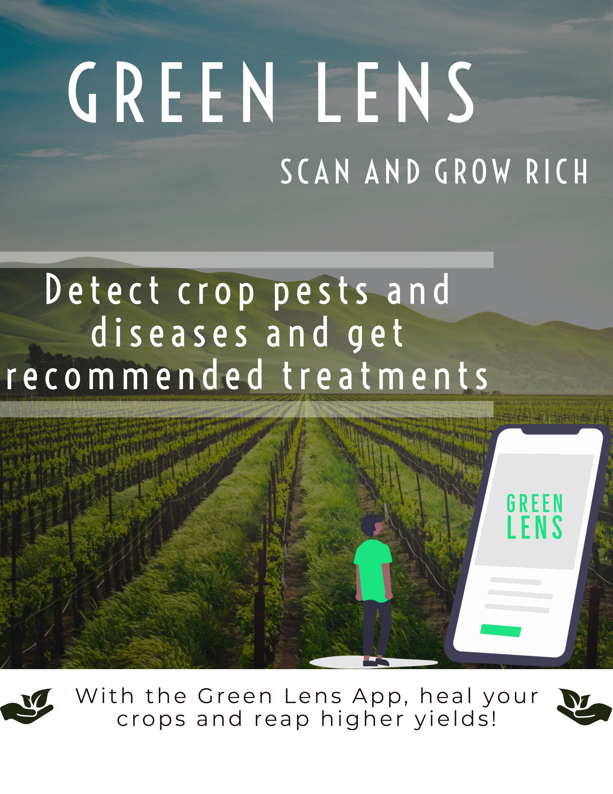
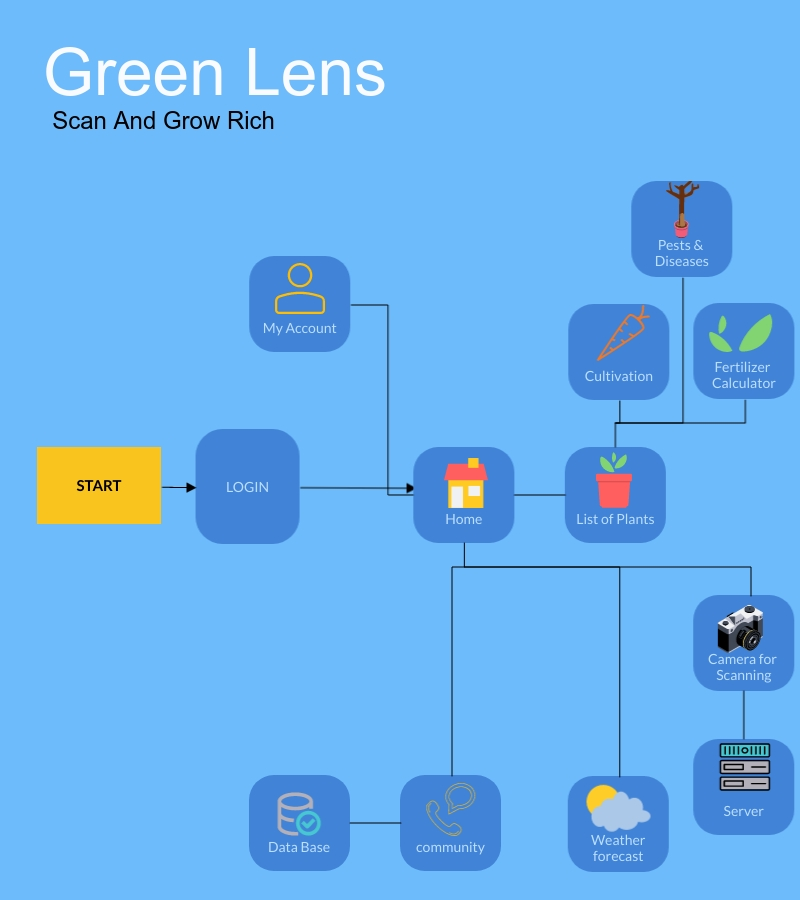
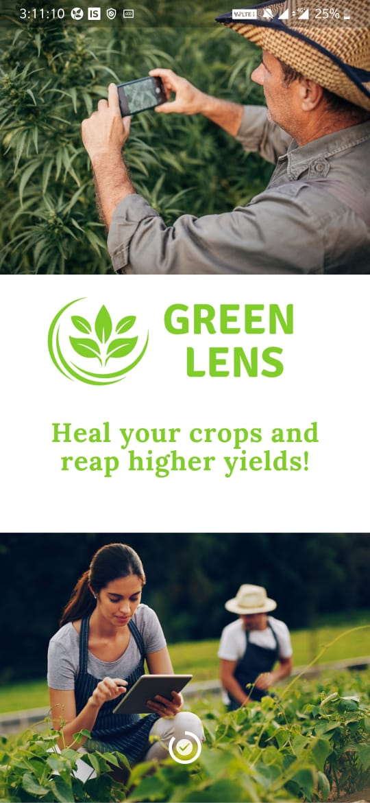
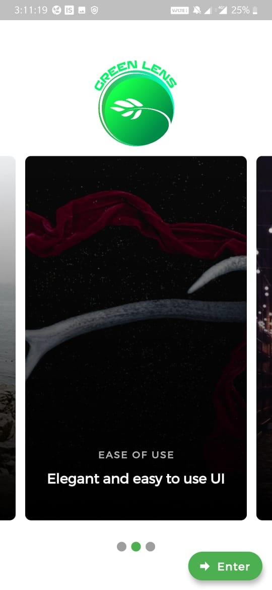
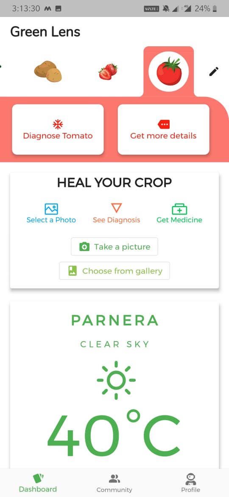
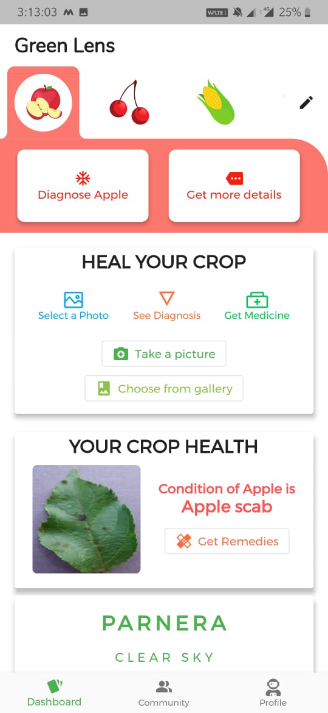
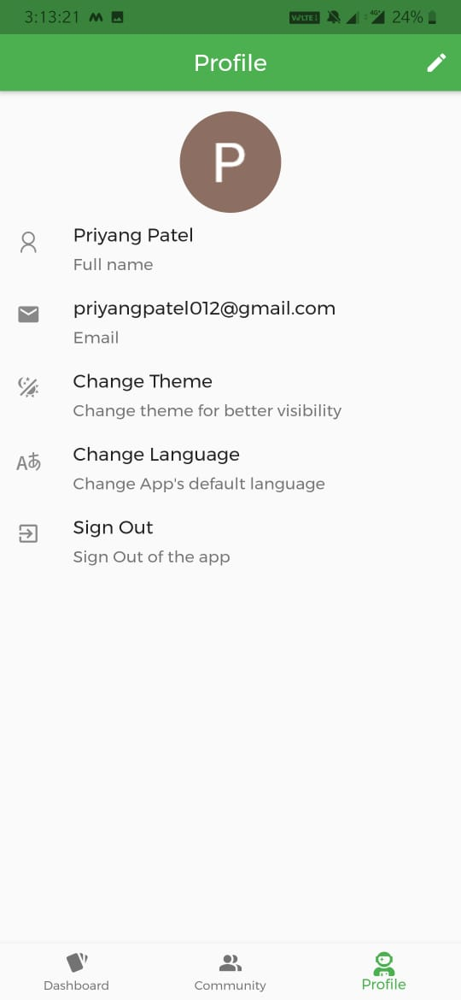
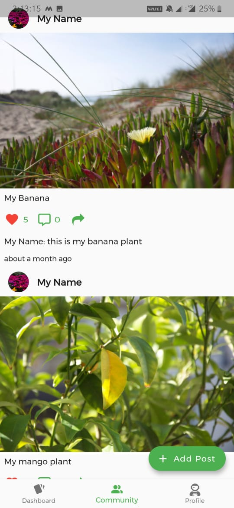
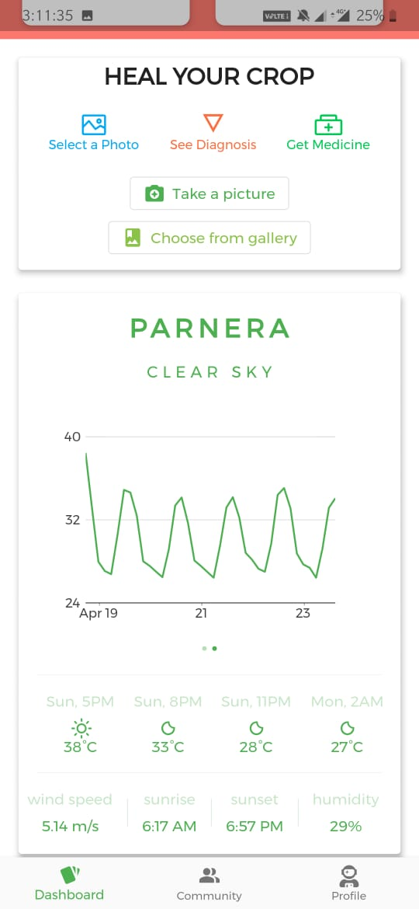
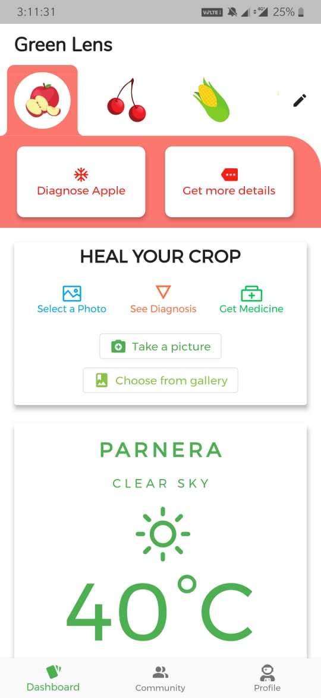

# Plant Disease Detection Application

# Flow Chart of our Application

# We've used weight pruning technique to get efficiency in CNN models

Weight pruning means eliminating unnecessary values in the weight tensors. We are practically setting the neural network parameters’ values to zero to remove what we estimate are unnecessary connections between the layers of a neural network. This is done during the training process to allow the neural network to adapt to the changes.

# API used in this project 
You can get the code here : https://github.com/madhavtripathi05/green-lens-api 

we have split 9 models in 3 different API each API contains three models so the response time as well as the server load can be decreased as we've hosted it on heroku.

# API Port and host 
you can change host and port number in app.js File

# Mobile Application

Splash Screens  
 
 

Home Screen and Detection 

   

 

Profile and Community  
   

 
Weather Details 

   

